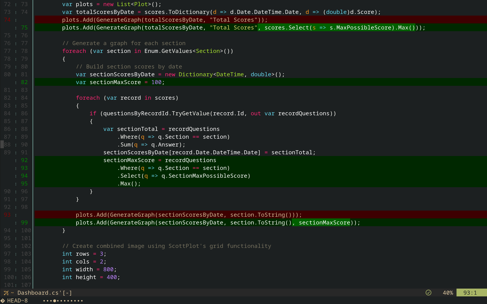

# deltaview.nvim

An inline diff viewer for Neovim using [delta](https://github.com/dandavison/delta) (git-delta). The delta pager provides two tier highlighting, and deltaview.nvim brings the unified/inline view into a buffer that lays on top of your current buffer. View and navigate your diffs seamlessly while reading and writing code.



## Why?

Current inline/unified diff viewers in neovim tend to use virtual lines to display negative changes. Cursors cannot land on virtual lines, and a large scope of negative changes will be skipped over when scrolling through a file, making it an unintuitive and flawed way to view a diff.

This plugin takes a less intrusive approach; display the delta pager output in a terminal buffer. These buffers are temporary and integrate seamlessly within a coding experience, using configurable keybinds to quickly swap in and out. Have you ever felt like you needed your lsp while reviewing a PR in your browser? Review the changes in neovim, using deltaview.nvim, and follow the code with your keyboard instead of your eyes.

If you aren't looking for an inline diff view, or are just looking for a code review tool that is mature and feature rich, [codediff.nvim](https://github.com/esmuellert/codediff.nvim/blob/main/README.md) may be a better fit for you. This is a tool for those who prefer inline diff views.

## Demo

<video src="./assets/DeltaViewDemo.mp4" controls></video>

## Features

- **Inline diff viewing**: View diffs on top of your code using delta's syntax highlighting
- **Cursor maintenance**: Viewing a diff from a buffer keeps your cursor where it was, and viewing code from a diff keeps your cursor where you want it to be. Easily transition between reading and writing.
- **Custom File Picker**: Review a large scope of changes
- **Custom UI**: Visual Indicators for hunk and file count
- **FZF integration**: Quick picker turns into a fuzzy finder picker for a large list of files
- **Smart sorting**: Files are sorted by quantity of changes
- **Flexible comparisons**: Compare against any git ref (HEAD, branches, commits, tags)

## Requirements

- Neovim >= 0.9
- [delta](https://github.com/dandavison/delta) (git-delta)
- Git
- (Optional) [fzf](https://github.com/junegunn/fzf) for a fuzzy finder

## Installation

[vim.pack](https://github.com/neovim/neovim/pull/34009)

```lua
vim.pack.add({ 'https://github.com/kokusenz/deltaview.nvim.git'})
```

Or your favorite plugin manager:

```lua
-- example: vim plug
Plug('kokusenz/deltaview.nvim')
```

No setup needed. If you want to modify configuration, put it in the `/after/plugin` directory.

```lua
require('deltaview').setup({
    -- configuration here
    -- example:
    keyconfig = {
        dv_toggle_keybind = "<leader>dd"
    },
    use_nerdfonts = false
})
```

The fzf file picker might be available out of the box, depending on how it was installed. If it does not work, you may need [additional setup](https://github.com/junegunn/fzf/blob/master/README-VIM.md) in your neovim config. Try adding the fzf binary to your `&runtimepath`, or installing fzf's vim integration using a package manager.

## Usage

### Commands

#### `:DeltaView [ref]`

Open an inline diff view for the current file.

```vim
:DeltaView           " Compare current file against HEAD
:DeltaView main      " Compare against main branch
:DeltaView HEAD~3    " Compare against 3 commits ago
:DeltaView v1.0.0    " Compare against tag v1.0.0
```

#### `:DeltaMenu [ref]`

Open an interactive menu to select and view diffs from all modified files.

```vim
:DeltaMenu           " Show all files changed from HEAD
:DeltaMenu develop   " Show all files changed from develop branch
```

**Note**: 
- Both commands use the last ref used. If `:DeltaMenu main` was used, future calls to `:DeltaMenu` and `:DeltaView` will default to `main` instead of `HEAD`.
- DeltaMenu requires Neovim's current working directory (`:pwd`) to be the git repository root. Use `:cd` to navigate to the git root if needed.

### Default Keybindings

| Key | Action |
|-----|--------|
| `<leader>dl` | :DeltaView |
| `<leader>dm` | :DeltaMenu |

When viewing a diff (DeltaView):

| Key | Action |
|-----|--------|
| `<Esc>` or `q` | Return to source file |
| `<Tab>` | Jump to next hunk |
| `<Shift-Tab>` | Jump to previous hunk |
| `]f` | Open next file in menu (if opened from DeltaMenu) |
| `[f` | Open previous file in menu (if opened from DeltaMenu) |

When in the file menu:

| Key | Action |
|-----|--------|
| Select a file | Open diff for that file |
| `alt-;` | Toggle between fzf and quickselect (in fzf mode) |

All keybindings are configurable

## Configuration

### Full Configuration Example

```lua
require('deltaview').setup({
  -- Enable nerd font icons for a prettier UI
  use_nerdfonts = true,

  -- Show both previous and next filenames when navigating
  -- false: shows "[2/5] -> next.lua"
  -- true: shows "<- prev.lua [2/5] -> next.lua"
  show_verbose_nav = false,

  -- Number of files threshold for switching to fzf
  -- When the number of modified files >= this value, use fzf instead of quickselect
  -- Set to 0 or 1 to always use fzf
  fzf_threshold = 6,

  -- Custom keybindings
  keyconfig = {
    -- Global keybind to toggle DeltaMenu
    dm_toggle_keybind = "<leader>dm",

    -- Global keybind to toggle DeltaView (and exit diff if open)
    dv_toggle_keybind = "<leader>dl",

    -- Navigate between hunks in a diff
    next_hunk = "<Tab>",
    prev_hunk = "<S-Tab>",

    -- Navigate between files (when opened from DeltaMenu)
    next_diff = "]f",
    prev_diff = "[f",

    -- Change diff menu view to quickselect (when in fzf mode)
    fzf_toggle = "alt-;",
  }
})
```

### View Configuration

When `use_nerdfonts = true`, the UI uses nerd font icons:

```lua
-- With nerd fonts
{
  dot = "",      -- Hunk indicator
  circle = "",   -- Current hunk indicator
  vs = "",      -- "versus" symbol in menu header
  next = "󰁕",    -- Next file indicator
  prev = "󰁎"     -- Previous file indicator
}

-- Without nerd fonts (default)
{
  dot = "·",
  circle = "•",
  vs = "comparing to",
  next = "->",
  prev = "<-"
}
```

## Feature Roadmap

- Tests
- Enable diffing subdirectories
- Options for using the pickers in:
    - [fzf-lua](https://github.com/ibhagwan/fzf-lua)
    - [telescope](https://github.com/nvim-telescope/telescope.nvim)
    - [snacks](https://github.com/folke/snacks.nvim)
- Option for overriding default sorting with user provided sorting function
- Split diffs, if there is demand. There are other plugins (and native neovim :DiffTool) that already do this, and do this well, so this is not a priority.
- Remove the [Process Exited 0] message, if I can figure out how

## License

MIT

## Contributing

Contributions are welcome! Please feel free to submit issues or pull requests.
